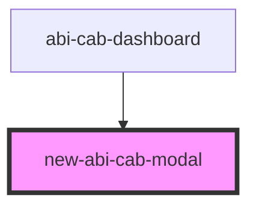

# new-abi-cab-modal

<!-- Auto Generated Below -->

## Properties

| Property | Attribute | Description | Type        | Default     |
| -------- | --------- | ----------- | ----------- | ----------- |
| `api`    | --        |             | `AbiCabApi` | `undefined` |

## Dependencies

### Used by

 - [abi-cab-dashboard](..)

### Graph

----------------------------------------------

* Copyright (c) 2022 bit2win team; *
