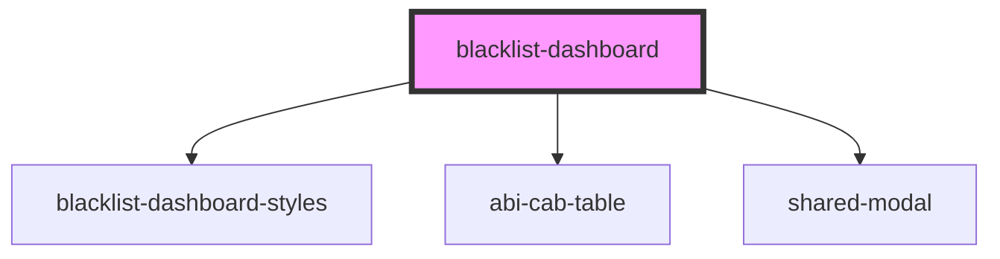

# blacklist-dashboard

<!-- Auto Generated Below -->

## Properties

| Property     | Attribute     | Description | Type     | Default     |
| ------------ | ------------- | ----------- | -------- | ----------- |
| `backendUrl` | `backend-url` |             | `string` | `undefined` |

## Dependencies

### Depends on

- [blacklist-dashboard-styles](../blacklist-dashboard-styles)
- [abi-cab-table](../abi-cab-table)
- [shared-modal](../shared-modal)

### Graph

----------------------------------------------

* Copyright (c) 2022 bit2win team; *
