# blacklist-dashboard

<!-- Auto Generated Below -->

## Properties

| Property              | Attribute                | Description | Type     | Default     |
| --------------------- | ------------------------ | ----------- | -------- | ----------- |
| `additionalHeaders`   | `additional-headers`     |             | `any`    | `undefined` |
| `backendUrl`          | `backend-url`            |             | `string` | `undefined` |
| `singleCustomerCrmId` | `single-customer-crm-id` |             | `number` | `undefined` |

## Dependencies

### Depends on

- [blacklist-dashboard-styles](../blacklist-dashboard-styles)
- [single-customer-dashboard](../single-customer-dashboard)
- [customers-dashboard](../customers-dashboard)
- [pod-pdr-dashboard](../pod-pdr-dashboard)
- [abi-cab-dashboard](../abi-cab-dashboard)
- [shared-modal](../shared-modal)
- [shared-snackbar](../shared-snackbar)

### Graph

```mermaid
graph TD;
  blacklist-dashboard --> blacklist-dashboard-styles
  blacklist-dashboard --> single-customer-dashboard
  blacklist-dashboard --> customers-dashboard
  blacklist-dashboard --> pod-pdr-dashboard
  blacklist-dashboard --> abi-cab-dashboard
  blacklist-dashboard --> shared-modal
  blacklist-dashboard --> shared-snackbar
  single-customer-dashboard --> edit-customer-modal
  single-customer-dashboard --> add-customer-modal
  single-customer-dashboard --> edit-customer-date-only-modal
  single-customer-dashboard --> dashboard-base-table
  dashboard-base-table --> shared-table-skeleton
  customers-dashboard --> edit-customers-modal
  customers-dashboard --> dashboard-base-filters
  customers-dashboard --> dashboard-base-table
  pod-pdr-dashboard --> edit-pod-pdr-modal
  pod-pdr-dashboard --> new-pod-pdr-modal
  pod-pdr-dashboard --> bulk-pod-pdr-modal
  pod-pdr-dashboard --> show-customers-pod-pdr-modal
  pod-pdr-dashboard --> dashboard-base-filters
  pod-pdr-dashboard --> dashboard-base-table
  abi-cab-dashboard --> edit-abi-cab-modal
  abi-cab-dashboard --> new-abi-cab-modal
  abi-cab-dashboard --> dashboard-base-filters
  abi-cab-dashboard --> dashboard-base-table
  style blacklist-dashboard fill:#f9f,stroke:#333,stroke-width:4px
```

----------------------------------------------

* Copyright (c) 2022 bit2win team; *
