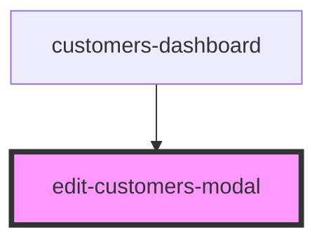

# edit-customers-modal

<!-- Auto Generated Below -->

## Properties

| Property      | Attribute | Description | Type         | Default     |
| ------------- | --------- | ----------- | ------------ | ----------- |
| `api`         | --        |             | `ClientiApi` | `undefined` |
| `documentIds` | --        |             | `any[]`      | `undefined` |

## Dependencies

### Used by

 - [customers-dashboard](..)

### Graph

----------------------------------------------

* Copyright (c) 2022 bit2win team; *
