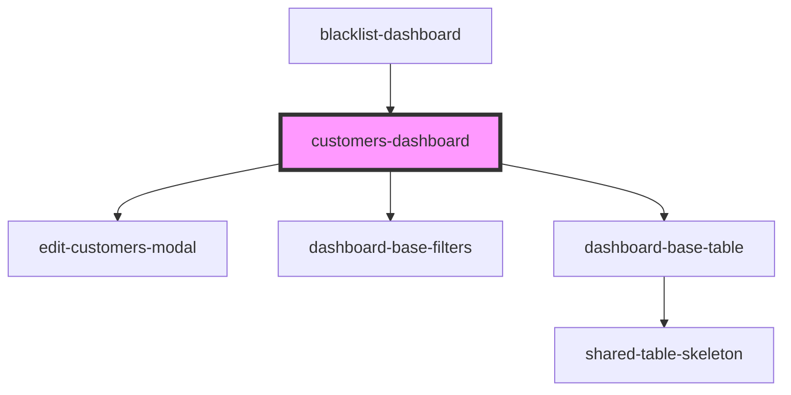

# customers-dashboard

<!-- Auto Generated Below -->

## Properties

| Property     | Attribute     | Description | Type     | Default     |
| ------------ | ------------- | ----------- | -------- | ----------- |
| `backendUrl` | `backend-url` |             | `string` | `undefined` |

## Dependencies

### Used by

 - [blacklist-dashboard](../blacklist-dashboard)

### Depends on

- [edit-customers-modal](components)
- [dashboard-base-filters](../dashboard-base-filters)
- [dashboard-base-table](../dashboard-base-table)

### Graph

----------------------------------------------

* Copyright (c) 2022 bit2win team; *
