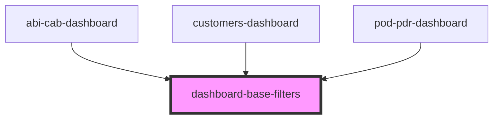

# dashboard-base-filters

<!-- Auto Generated Below -->

## Properties

| Property   | Attribute   | Description | Type                                    | Default     |
| ---------- | ----------- | ----------- | --------------------------------------- | ----------- |
| `storeKey` | `store-key` |             | `"abi-cab" \| "customers" \| "pod-pdr"` | `undefined` |

## Dependencies

### Used by

 - [abi-cab-dashboard](../abi-cab-dashboard)
 - [customers-dashboard](../customers-dashboard)
 - [pod-pdr-dashboard](../pod-pdr-dashboard)

### Graph

----------------------------------------------

* Copyright (c) 2022 bit2win team; *
