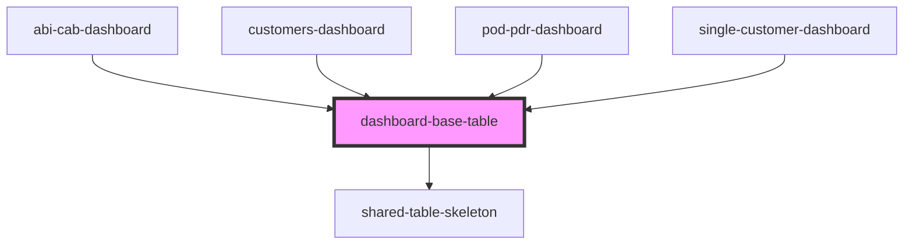

# dashboard-base-table

<!-- Auto Generated Below -->

## Properties

| Property        | Attribute        | Description | Type                                    | Default     |
| --------------- | ---------------- | ----------- | --------------------------------------- | ----------- |
| `exportFn`      | --               |             | `() => void`                            | `undefined` |
| `isLoading`     | `is-loading`     |             | `boolean`                               | `undefined` |
| `payloadAction` | `payload-action` |             | `any`                                   | `undefined` |
| `storeKey`      | `store-key`      |             | `"abi-cab" \| "customers" \| "pod-pdr"` | `undefined` |

## Events

| Event              | Description | Type                                        |
| ------------------ | ----------- | ------------------------------------------- |
| `tableActionEvent` |             | `CustomEvent<{ type: string; data: any; }>` |

## Dependencies

### Used by

 - [abi-cab-dashboard](../abi-cab-dashboard)
 - [customers-dashboard](../customers-dashboard)
 - [pod-pdr-dashboard](../pod-pdr-dashboard)
 - [single-customer-dashboard](../single-customer-dashboard)

### Depends on

- [shared-table-skeleton](../shared-table-skeleton)

### Graph

----------------------------------------------

* Copyright (c) 2022 bit2win team; *
