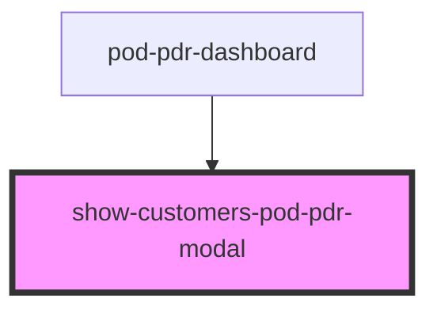

# show-customers-pod-pdr-modal

<!-- Auto Generated Below -->

## Properties

| Property    | Attribute | Description | Type    | Default     |
| ----------- | --------- | ----------- | ------- | ----------- |
| `customers` | --        |             | `any[]` | `undefined` |

## Dependencies

### Used by

 - [pod-pdr-dashboard](..)

### Graph

----------------------------------------------

* Copyright (c) 2022 bit2win team; *
