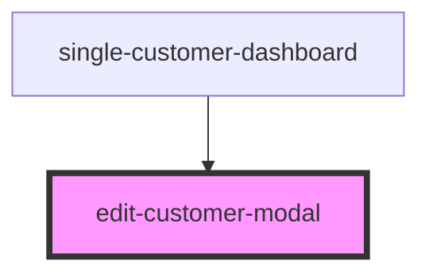

# edit-customer-modal

<!-- Auto Generated Below -->

## Properties

| Property               | Attribute | Description | Type          | Default     |
| ---------------------- | --------- | ----------- | ------------- | ----------- |
| `api`                  | --        |             | `ClientiApi`  | `undefined` |
| `customerBlacklistRow` | --        |             | `CustomerRow` | `undefined` |

## Dependencies

### Used by

 - [single-customer-dashboard](..)

### Graph

----------------------------------------------

* Copyright (c) 2022 bit2win team; *
