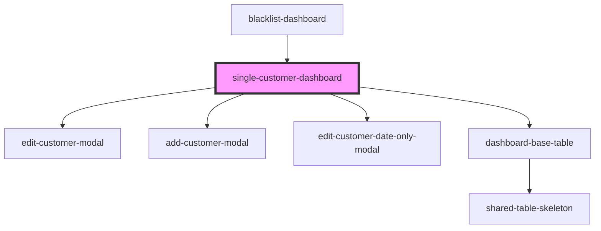

# single-customer-dashboard

<!-- Auto Generated Below -->

## Properties

| Property            | Attribute            | Description | Type     | Default     |
| ------------------- | -------------------- | ----------- | -------- | ----------- |
| `additionalHeaders` | `additional-headers` |             | `any`    | `undefined` |
| `backendUrl`        | `backend-url`        |             | `string` | `undefined` |
| `crmId`             | `crm-id`             |             | `string` | `undefined` |

## Dependencies

### Used by

 - [blacklist-dashboard](../blacklist-dashboard)

### Depends on

- [edit-customer-modal](components)
- [add-customer-modal](components)
- [edit-customer-date-only-modal](components)
- [dashboard-base-table](../dashboard-base-table)

### Graph

----------------------------------------------

* Copyright (c) 2022 bit2win team; *
